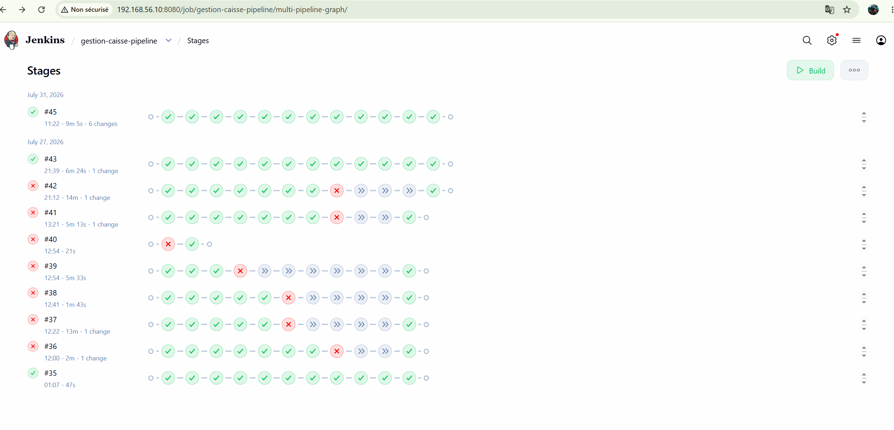
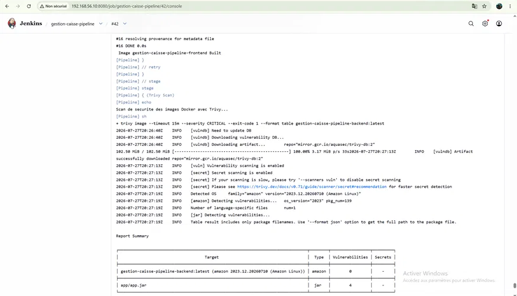
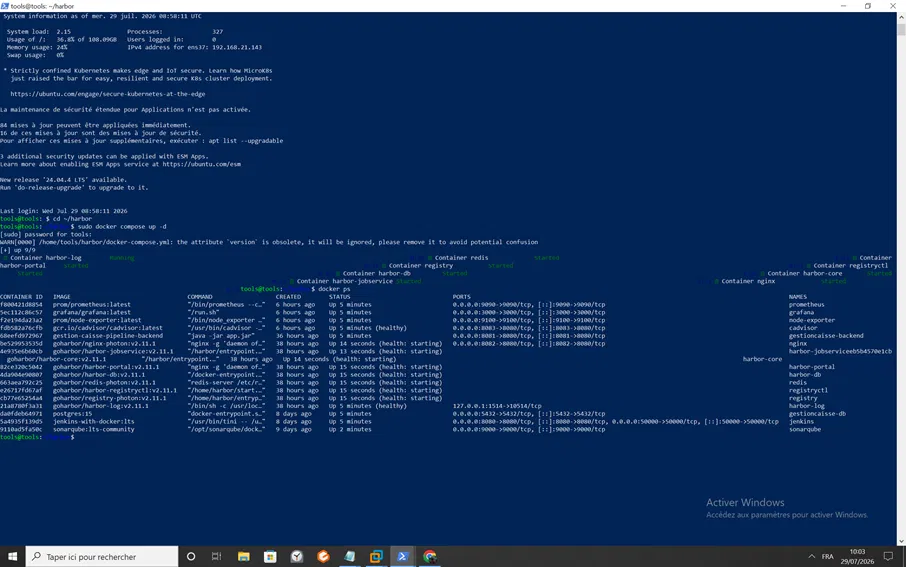
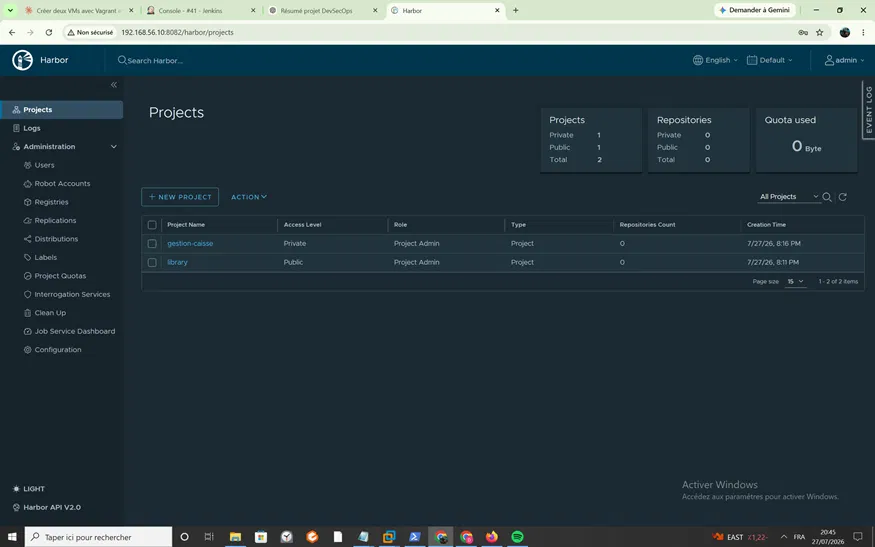
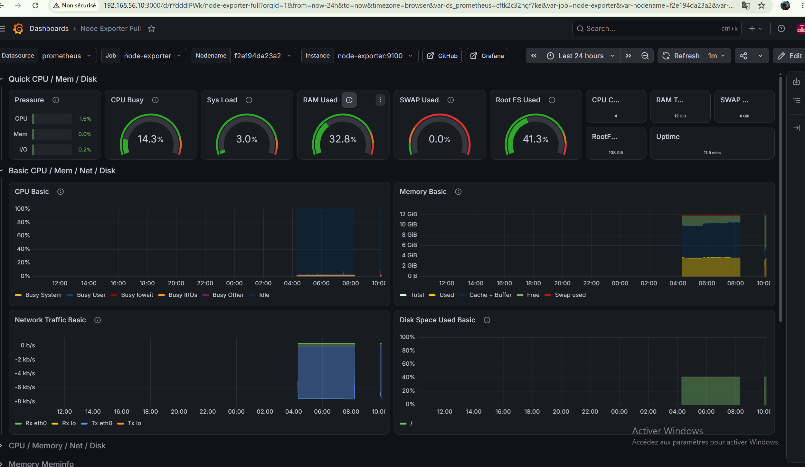
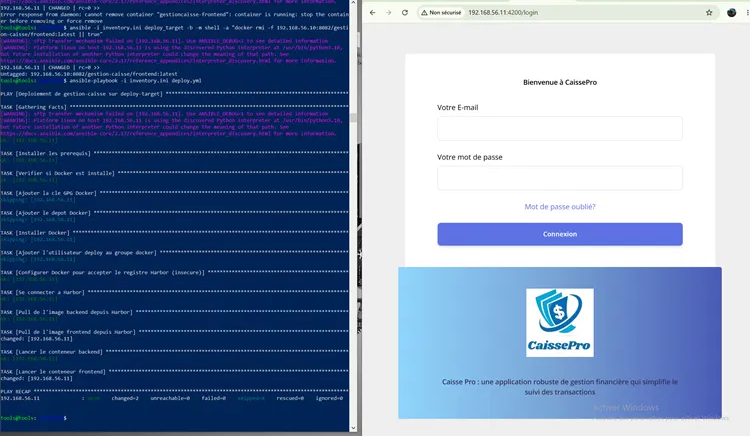

# Pipeline CI/CD DevSecOps — CaissePro

Pipeline CI/CD complet et sécurisé (DevSecOps) conçu pendant mon stage chez **EcoCode Engineering** (1 mois, juillet–août 2026), pour l'application **CaissePro**, une solution de gestion de caisse.

Ce dépôt contient uniquement les fichiers d'infrastructure et d'automatisation que j'ai conçus (Jenkinsfile, configuration Docker, monitoring) — le code source de l'application elle-même reste la propriété du client et n'est pas partagé ici.

## 🎯 Objectif du projet

Automatiser entièrement le cycle de build, test, analyse de sécurité et déploiement d'une application conteneurisée, en intégrant des contrôles de qualité et de sécurité **bloquants** à chaque étape — c'est-à-dire qu'un code non conforme ne peut pas atteindre la production.

## 🏗️ Architecture du pipeline

```
Code Push → Jenkins → Tests & SonarQube → OWASP Dependency-Check
    → Build Docker → Trivy Scan → Push Harbor → Deploy Ansible → Monitoring Grafana
```

## 🛠️ Stack technique

| Outil | Rôle |
|---|---|
| **Jenkins** | Orchestration du pipeline CI/CD |
| **SonarQube** | Analyse statique de la qualité du code + Quality Gate bloquant |
| **OWASP Dependency-Check** | Détection des vulnérabilités dans les dépendances |
| **Docker / Docker Compose** | Conteneurisation du backend et frontend |
| **Trivy** | Scan de sécurité des images Docker (bloque le pipeline si vulnérabilité critique) |
| **Harbor** | Registre Docker privé |
| **Ansible** | Déploiement automatisé (Infrastructure as Code) |
| **Prometheus / Grafana** | Supervision et monitoring en temps réel de l'infrastructure |

## 🔒 Point fort : sécurité intégrée et bloquante

Le pipeline ne se contente pas d'analyser — il **bloque** activement les déploiements non conformes :
- Le **Quality Gate SonarQube** stoppe le pipeline si le code ne respecte pas les standards de qualité.
- **Trivy** scanne chaque image Docker et bloque le pipeline en cas de vulnérabilité de sévérité CRITICAL.
- L'historique des builds (voir capture ci-dessous) montre plusieurs échecs volontaires du pipeline suite à des non-conformités détectées — la preuve que les contrôles fonctionnent réellement, et ne sont pas de simples formalités.



## 📸 Captures d'écran

### Scan de sécurité Trivy
Détection automatique des vulnérabilités sur les images Docker avant tout déploiement.



### Infrastructure complète en fonctionnement
Vue d'ensemble de tous les services actifs : Jenkins, SonarQube, Harbor, Prometheus, Grafana, PostgreSQL.



### Registre Docker privé (Harbor)
Organisation des images Docker validées et prêtes au déploiement.



### Supervision Grafana
Monitoring en temps réel des ressources système (CPU, RAM, disque, réseau).



### Déploiement automatisé avec Ansible
Déploiement des conteneurs backend/frontend et vérification que l'application CaissePro est bien accessible.



## 🔐 Sécurité et bonnes pratiques

Tous les secrets (tokens SonarQube, clé API NVD, mots de passe) sont gérés via **Jenkins Credentials** et des **variables d'environnement** (`.env`, exclu du dépôt via `.gitignore`) — aucun secret n'est exposé en clair dans le code versionné. Un fichier `.env.example` est fourni pour indiquer la structure attendue.

## 👤 Auteur

**Mahmoud Chtioui**
Étudiant Ingénieur en Télécommunications — Automotive Technology | DevOps & Cloud Computing
[LinkedIn](https://www.linkedin.com/in/mahmoud-chtioui-821a5b437)
